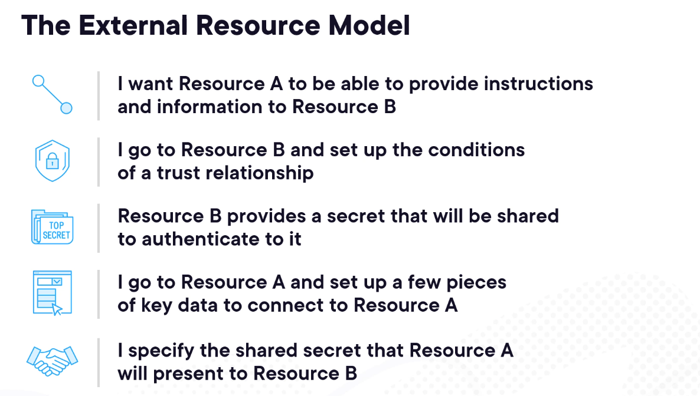

# Jenkins
---

**Paramters**

- Parameters are variables whose values are chosen when a build is triggered, then used inside the job or pipeline logic.

- Typical uses: choosing environment (dev/qa/prod), branch name, version tag, feature flags, or file paths.


---
**Clean working directory** : cleanWs()

**Post Build Artifacts** : archiveArtifacts artifacts: '{path}' 

```jenkins
pipeline {
    agent any

    stages {
        stage('Build') {
            steps {
                cleanWs()
                sh 'echo "Hello World"'
                sh 'echo "Building a new laptop ....."'
                sh 'mkdir build'
                sh 'touch build/computer.txt'
                sh 'echo "MainBoard" >> build/computer.txt'
                sh 'echo "Display" >> build/computer.txt'
                sh 'cat build/computer.txt'
            }
        }
    }
    post {

        success{

            archiveArtifacts artifacts: 'build/**'
        }
    }
}

```
**Combining Multiple Steps into one**

You have to give all your commands inside ''' '''

sh '''
	....
	....
	....
'''


```groovy


pipeline {
    agent any

    stages {
        stage('Build') {
            steps {
                cleanWs()
		sh '''
			mkdir -p build
			touch build/computer.txt
			echo "Mainboard" >> build/computer.txt
			cat build/computer.txt
			echo "Display" >> build/computer.txt
			cat build/computer.txt
		'''
            }
        }
    }
    post {
        
        success{
            
            archiveArtifacts artifacts: 'build/**'
        }
    }
}


```

**Multiple stages with test validations**


```groovy

pipeline {
    agent any

    stages {
        stage('Build') {
            steps {
                cleanWs()
                sh '''
                    mkdir -p build
                    touch build/computer.txt
                    echo "Mainboard" >> build/computer.txt
                    cat build/computer.txt
                    echo "Display" >> build/computer.txt
                    cat build/computer.txt
                '''
            }
        }
        stage('Test') {
            steps {
                echo 'Testing the laptop..........'
                sh 'test -f build/computer.txt'
            }
        }
    }
    post {
        success {
            archiveArtifacts artifacts: 'build/**'
        }
    }
}

```
**Declaring and Defining Environment Variables**

```groovy

pipeline {
    agent any
    
    environment {
        
        build_filename = 'laptop'
    }

    stages {
        stage('Hello') {
            steps {
                cleanWs()
                echo 'Building a new laptop...'
                sh '''mkdir -p build
                    touch build/"${build_filename}".txt
                    echo "Mainboard" >> build/"${build_filename}".txt'''
            }
        }
    }
}

```


**Docker container as agent**

To use docker container as agent. 

```groovy


pipeline {
    agent any

    stages {
        stage('Without Docker') {
            steps {
                echo 'Hello World'
            }
        }

        stage('With Docker') {
            agent {
                docker {
                    image 'node:18-alpine'
                }
            }
            steps {
                sh 'npm --version'
            }
        }
    }
}


```


**Workspace Synchronization**

```groovy


pipeline {
    agent any

    stages {
        stage('Without Docker') {
            steps {
                echo 'Hello World'
            }
        }

        stage('With Docker') {
            agent {
                docker {
                    image 'node:18-alpine'
		    reuseNode true
                }
            }
            steps {
                sh 'npm --version'
            }
        }
    }
}


```
# Parallel builds in Docker


```jenkins


pipeline {
    agent any

    parameters {
        string(name: 'branch', defaultValue: 'master', description: 'The branch to build ')
    }

    triggers {
        cron('0 3 * * 1-5')
    }

    environment {
        SENTENCE = "A thousand splendid sons"
    }

    stages {
        stage('SCM') {
            steps {
                git branch: "${params.branch}", url: 'https://github.com/venkatamamidibathula/jenkins.git'
            }
        }

        stage('Build and Package in Parallel') {
            parallel {
                stage('Build') {
                    steps {
                        echo "Building the code from branch ${params.branch}"
                    }
                }
                stage('Package') {
                    when {
                        expression {
                            return params.branch ==  "${params.branch}"
                        }
                    }
                    steps {
                        echo "Packaging the code from branch ${params.branch}"
                    }
                }
            }
        }
    }
}


```


**Multi-Stage builds**


---

# Artifact pipeline


```jenkins

pipeline {
    agent any
    environment {
        ARTIFACT_SOURCE_DIRECTORY = "tests/*.xml"
    }
    stages {
        stage('Build and Package in Parallel') {
            parallel {
                stage('Build') {
                    steps {
                        echo "Building the code from branch ${env.BRANCH_NAME}"
                    }
                }
                stage('Package') {
                    steps {
                        echo "Packaging the code from branch ${env.BRANCH_NAME}"
                    }
                }
            }
        }
        stage('Run Tests') {
            steps {
                echo "Running tests and generating artifacts in ${env.ARTIFACT_SOURCE_DIRECTORY}"
                sh 'mkdir -p tests && echo "<testsuite><testcase classname=\\"example\\" name=\\"test1\\"/></testsuite>" > tests/test-results.xml'
            }
        }
        stage('Publish Artifacts') {
            steps {
                echo "Publishing artifacts from ${env.ARTIFACT_SOURCE_DIRECTORY}"
                archiveArtifacts artifacts: "${env.ARTIFACT_SOURCE_DIRECTORY}", followSymlinks: false
            }
        }
    }
    post {
        always {
            archiveArtifacts artifacts: "${env.ARTIFACT_SOURCE_DIRECTORY}", followSymlinks: false, allowEmptyArchive: true
            cleanWs()
        }
    }
}


```

# External Resource Model




```
